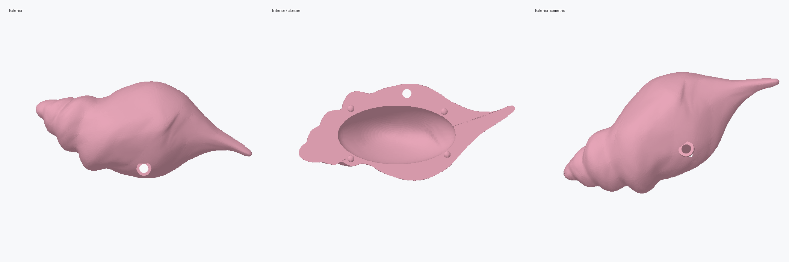
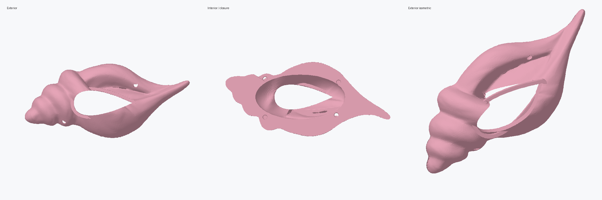

# Magic Conch faithful remaster — corrected layout

This is the corrected, recommended enclosure. It treats the supplied
`magicconch_smoothed_original.stl` as the authoritative exterior and builds the
functional housing inside it.





## What is preserved

- The original 150 mm conch silhouette, proportions, pointed end, organic lower
  edge, and spiral character.
- The exterior vertices are not moved by Laplacian or Taubin smoothing. Curved
  interpolation and one subdivision pass remove visible triangle transitions,
  after which the result is locked back to the original X/Y/Z envelope.
- The original modeled string and ring are excluded so a real pull mechanism can
  be installed.

## Correct housing assignment

- The plain/front housing is closed and continuous. It has no speaker grille.
- The rounded-to-pointed speaker/mesh opening is on the spiral-side back housing,
  matching the location marked in the supplied SolidWorks screenshot.
- The round internal speaker and PCB mounting pegs from the earlier revision have
  been removed. Those cavity areas remain flat and unobstructed.

## Functional remaster

- Two deeply hollowed halves with a nominal 3.0 mm wall and 0.4 mm total seam
  separation.
- Four forked snap posts and matching detent sockets. Every 3.3 mm root-pad
  perimeter is checked against the original shell projection, keeping the closure
  hardware concealed inside the assembled outline.
- Rounded-to-pointed speaker opening on the back housing, based on the
  reference-video mesh profile.
- A low, 2.8 mm internal mesh-retaining ledge around the back opening, without
  protruding speaker or PCB mounting pegs.
- A 6.5 mm pull-string opening with an internal reinforcing collar. The string,
  spool, spring, chain, and return mechanism are separate hardware.

No exterior button or microphone holes are included yet because their final
diameters and component locations have not been measured. Those cuts should be
added to the native parts after choosing the actual hardware.

## Primary files

- `MagicConch_FrontHousing_Remaster.SLDPRT` - SolidWorks front housing.
- `MagicConch_BackHousing_Remaster.SLDPRT` - SolidWorks back housing.
- `MagicConch_FrontHousing_Remaster_print.stl` - authoritative front print mesh.
- `MagicConch_BackHousing_Remaster_print.stl` - authoritative back print mesh.
- `MagicConch_FrontHousing_Remaster_preview.png` and
  `MagicConch_BackHousing_Remaster_preview.png` - exterior/interior inspection
  renders.

## Validation

- Front STL: 34,138 triangles, one component, zero boundary edges, zero
  non-manifold edges, and positive enclosed volume.
- Back STL: 37,168 triangles, one component, zero boundary edges, zero
  non-manifold edges, and positive enclosed volume.
- Assembled solid-intersection volume: 0.0 mm3. The two shells do not collide in
  their modeled assembled positions; snap-head interference occurs only while
  the forked posts flex through the socket throats.
- Both STEP conversions imported into SolidWorks 2024 and saved as one solid body
  with zero import or save errors.
- SolidWorks' deep body checker reports six face-to-face consistency warnings per
  part because the native files are simplified faceted BREP conversions. Use the
  full-resolution watertight STLs as the print masters.

## Prototype-print guidance

Print the front half in PETG for better snap flexibility. Before a complete print,
make a seam/snap test section or stop a low-infill print after the first 8-10 mm.
If your printer produces a tight fit, enlarge each back socket by 0.10-0.20 mm of
radial clearance in SolidWorks.

## Regeneration

```powershell
python tools/build_conch_remaster.py reference/magicconch_smoothed_original.stl prototype/remaster
```
