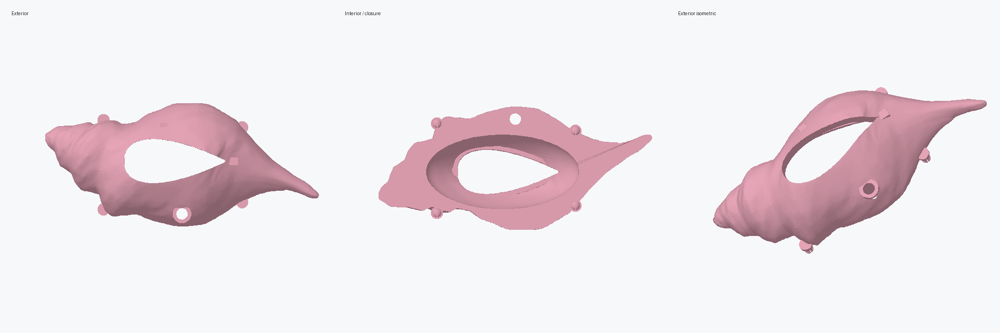
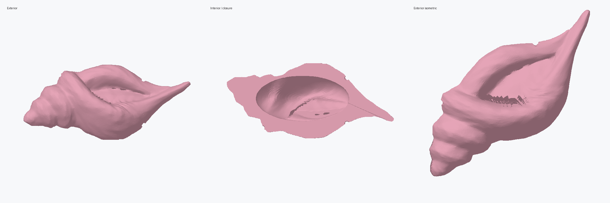

# Magic Conch housing V2

> **Superseded:** This exploratory revision changed too much of the source surface
> and placed its closure hardware too close to the projected edge. Use
> [`../remaster/`](../remaster/) for the faithful, recommended design.

This revision translates the construction shown in the reference video into a
printable two-piece electronics enclosure while preserving the original conch
silhouette.





## Changes from V1

- Smoothed and subdivided exterior surface; the coarse triangular facets and
  high-frequency bumps from the source scan have been reduced.
- Deep hollow cavity in both halves with a nominal 3.0 mm outer wall.
- Four hidden split snap posts on the front half and matching detent sockets on
  the back half. The split posts flex during assembly instead of relying on a
  rigid interference fit.
- Rounded-to-pointed, leaf-shaped speaker opening modeled after the grille in
  the reference video.
- 2.5 mm internal perimeter mesh seat with 0.25 mm opening clearance and four
  support bridges. Cut metal mesh slightly larger than the opening and retain it
  from inside with epoxy, heat stakes, or a thin printed retaining frame.
- 6.5 mm pull-string passage with an internal reinforcing collar. The string,
  bead chain, spool, and return mechanism remain separate hardware.
- Visible M3 closure holes from V1 have been removed; the four snaps now retain
  the enclosure.

## Primary files

- `MagicConch_FrontHousing_V2.SLDPRT` - SolidWorks front housing for layout and
  fit work.
- `MagicConch_BackHousing_V2.SLDPRT` - SolidWorks back housing.
- `MagicConch_FrontHousing_V2_print.stl` - authoritative watertight front print
  mesh.
- `MagicConch_BackHousing_V2_print.stl` - authoritative watertight back print
  mesh.
- `MagicConch_FrontHousing_V2_preview.png` and
  `MagicConch_BackHousing_V2_preview.png` - exterior/interior inspection renders.

## Prototype dimensions and fit

- Assembled envelope: approximately 150 x 70 x 68 mm.
- Total modeled seam separation: 0.4 mm.
- Snap stem diameter: 3.5 mm.
- Snap head diameter: 4.5 mm with a 0.75 mm flex slot.
- Socket throat diameter: 3.96 mm.
- Socket detent diameter: 4.9 mm.
- Speaker grille opening: approximately 57 x 36 mm.
- Pull-string opening: 6.5 mm diameter.

Print a low-infill front/back fit coupon or the first 8-10 mm around the seam
before committing to a full print. FDM dimensional error varies by material and
printer; if the snaps are too tight, enlarge the sockets by 0.10-0.20 mm radial
clearance in SolidWorks. PETG is preferred for the snap-post half because it is
less brittle than standard PLA.

## Validation

Both authoritative STLs have zero boundary edges, zero non-manifold edges, one
connected component, and positive enclosed volume. Both STEP conversions opened
in SolidWorks 2024 and saved as a single solid body with no import or save errors.
SolidWorks' deep body checker reports the same six face-to-face inconsistency
warnings seen in V1 because the native parts are simplified faceted BREP imports.
Use the full-resolution watertight STLs as the print masters.

## Regeneration

From the repository root, with the local geometry dependencies available:

```powershell
python tools/build_video_reference_v2.py reference/magicconch_smoothed_original.stl prototype/v2
```

The script smooths the original source, generates the hollow halves, applies the
functional cuts and snap geometry, and writes the print-master STLs.
